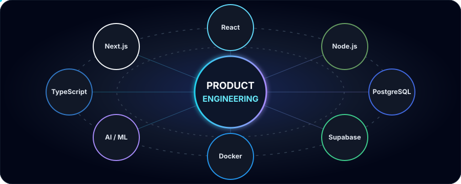
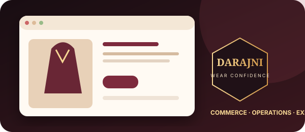
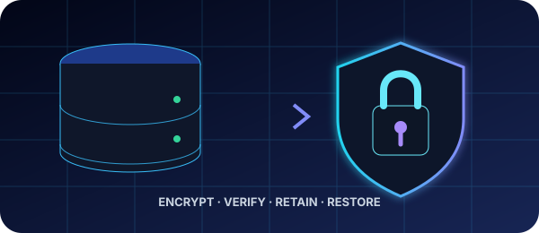
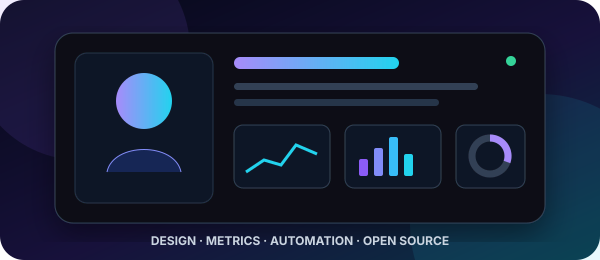
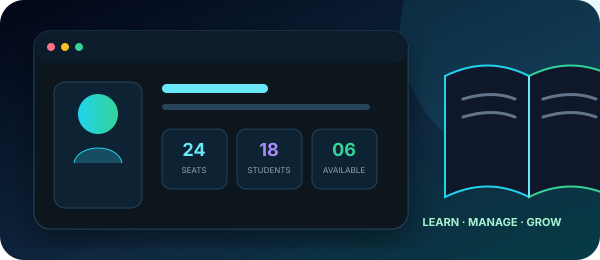
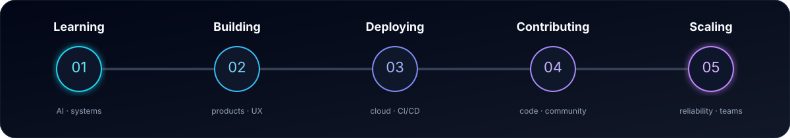
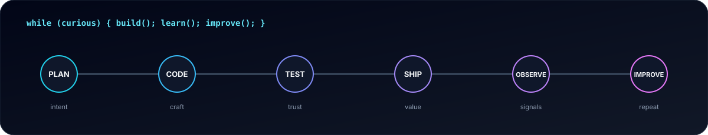
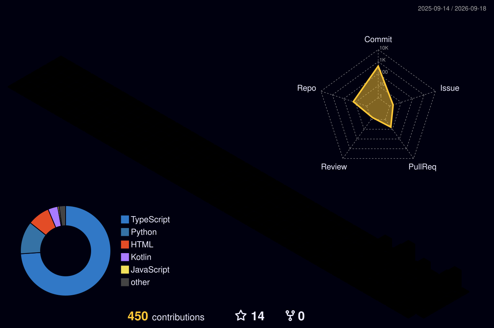
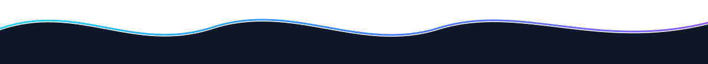

<!--
  Premium GitHub Profile README
  Owner: Aman Krishna
  GitHub: 7amankrishna

  Deployment:
  1. Create a public repository named exactly "7amankrishna".
  2. Copy this README, the assets directory, and the .github directory into it.
  3. Enable Actions with read/write workflow permissions.
  4. Optional: add a classic PAT named METRICS_TOKEN for the richest metrics data.

  Personal links are collected near the top and in the Contact section so they
  are easy to update without touching the dashboard markup.
-->

<!-- HERO -->

  

  

  

    
    
    
  

  

    
    
    
    
  

  

    <b>Full-stack builder from India</b> 
    I turn ambitious ideas into clear, secure, production-ready digital products.
  

<!-- ABOUT ME -->
## About Me

<table>
  <tr>
    <td width="50%" valign="top">
      <h3>What I do</h3>
      
💼 <b>Current role:</b> Full-Stack Software Engineer & Product Builder

      
🧭 <b>Interests:</b> AI-enabled products, modern web platforms, commerce systems, developer experience, and thoughtful UI/UX

      
📚 <b>Learning:</b> Applied LLM patterns, scalable system design, observability, and cloud-native delivery

      
🛠️ <b>Building:</b> DARAJNI, resilient data workflows, and tools that remove friction for real users

    </td>
    <td width="50%" valign="top">
      <h3>How I work</h3>
      
🤝 <b>Collaboration:</b> Open-source tools, AI/ML applications, React/Next.js products, and early-stage startup builds

      
🎯 <b>Principle:</b> Start with the user, keep the system honest, and make the final experience feel effortless

      
⚡ <b>Fun fact:</b> I care as much about the loading, empty, and failure states as the happy path

      
📍 <b>Location:</b> India &nbsp;·&nbsp; 🌐 <a href="https://amankrishna.in">amankrishna.in</a> &nbsp;·&nbsp; ✉️ <a href="mailto:7amankrishna@gmail.com">Email me</a>

    </td>
  </tr>
</table>

<!-- SKILLS -->
## Skills

<table>
  <tr>
    <td align="center" width="20%"><b>Languages</b></td>
    <td></td>
  </tr>
  <tr>
    <td align="center"><b>AI / ML</b></td>
    <td> &nbsp;   </td>
  </tr>
  <tr>
    <td align="center"><b>Web</b></td>
    <td></td>
  </tr>
  <tr>
    <td align="center"><b>Data</b></td>
    <td></td>
  </tr>
  <tr>
    <td align="center"><b>DevOps</b></td>
    <td></td>
  </tr>
  <tr>
    <td align="center"><b>Cloud</b></td>
    <td></td>
  </tr>
</table>

<!-- TECH STACK VISUALIZATION -->
## Tech Stack

  

 

  

 

| Area | Working mode | Focus |
|---|---|---|
| Product engineering | `██████████` Daily driver | Accessible interfaces, clear flows, responsive systems |
| Full-stack web | `██████████` Daily driver | Next.js, TypeScript, React, APIs, PostgreSQL |
| Platform & delivery | `████████░░` Building deeply | CI/CD, backups, security, caching, observability |
| Applied AI/ML | `███████░░░` Expanding | LLM applications, retrieval, computer vision, evaluation |

> Bars show current focus—not a claim that learning ever reaches 100%.

<!-- FEATURED PROJECTS -->
## Featured Projects

<table>
  <tr>
    <td width="50%" valign="top">
      
      <h3>DARAJNI — Production Commerce Platform</h3>
      
Made-to-order fashion commerce with a responsive storefront, secure checkout, Razorpay/PayU payments, order tracking, inventory controls, admin operations, logistics integrations, and resilient backups.

      

        
        
        
      

      
<code>Next.js</code> <code>TypeScript</code> <code>Supabase</code> <code>PostgreSQL</code> <code>Tailwind</code>

      

        
        
      

    </td>
    <td width="50%" valign="top">
      
      <h3>Encrypted Backup & Disaster Recovery</h3>
      
A production-oriented backup pipeline for Supabase PostgreSQL and Storage with AES-256-GCM encryption, manifests, integrity verification, retention controls, health reporting, and safe restore tooling.

      

        
        
        
      

      
<code>Node.js</code> <code>TypeScript</code> <code>PostgreSQL</code> <code>Firebase</code> <code>GitHub Actions</code>

      

        
        
      

    </td>
  </tr>
  <tr>
    <td width="50%" valign="top">
      
      <h3>Living GitHub Profile Dashboard</h3>
      
A fast, accessible developer portfolio powered by local SVG artwork and scheduled GitHub Actions for metrics, contribution animations, activity, and a 3D contribution calendar.

      

        
        
        
      

      
<code>Markdown</code> <code>SVG</code> <code>GitHub Actions</code> <code>GitHub API</code>

      

        
        
      

    </td>
    <td width="50%" valign="top">
      
      <h3>New Talent Digital Library</h3>
      
A responsive library management platform with public seat availability, student and administrator dashboards, authentication, Supabase data workflows, web push notifications, and installable PWA support.

      

        
        
        
      

      
<code>Next.js</code> <code>TypeScript</code> <code>Supabase</code> <code>PostgreSQL</code> <code>PWA</code>

      

        
        
      

    </td>
  </tr>
  <tr>
    <td colspan="2" valign="middle" align="center">
      <h3>More work, experiments & open source</h3>
      
I document what I build, share reusable ideas, and keep active work visible.

      
    </td>
  </tr>
</table>

<!-- CURRENT FOCUS -->
## Current Focus

  

  
<b>Roadmap notes</b>

   

- **Learning:** LLM application architecture, evaluation, observability, and system design.
- **Building:** Useful full-stack products with strong UX and dependable backends.
- **Deploying:** Automated, measurable releases with safe operational workflows.
- **Contributing:** Documentation, fixes, reusable components, and thoughtful reviews.
- **Scaling:** Performance, security, reliability, and maintainable team practices.

<!-- ANIMATED DEVELOPER LOOP: SVG is lighter and more accessible than a hosted GIF. -->
## Developer Loop

  

<!-- GITHUB STATS -->
## GitHub Stats

  
  

  

  

<!-- ACTIVITY -->
## Activity

  

  

  
<b>GitHub Metrics dashboard</b>

   
  

    
  

  
<b>3D contribution calendar</b>

   
  

    
  

<!-- OPEN SOURCE -->
## Open Source

<table>
  <tr>
    <td align="center" width="20%">
       Code, docs, reviews
    </td>
    <td align="center" width="20%">
       Changes proposed
    </td>
    <td align="center" width="20%">
       Problems explored
    </td>
    <td align="center" width="20%">
       Teams & communities
    </td>
    <td align="center" width="20%">
       Tools worth sharing
    </td>
  </tr>
</table>

I value contributions that make a project easier to understand, safer to operate, or more pleasant to use—not only larger code changes.

<!-- ACHIEVEMENTS -->
## Achievements

<table>
  <tr>
    <td width="25%" align="center"><h3>🚀 Production</h3>
Shipped a full-stack commerce platform from storefront to operations.
</td>
    <td width="25%" align="center"><h3>🔐 Reliability</h3>
Built encrypted, verifiable backup and disaster-recovery workflows.
</td>
    <td width="25%" align="center"><h3>⚙️ Automation</h3>
Created CI-driven metrics, releases, maintenance, and profile assets.
</td>
    <td width="25%" align="center"><h3>🌱 Milestone</h3>
Continuously turning learning into documented, working software.
</td>
  </tr>
</table>

  
  
  
  

### Credentials & Recognition

<table>
  <tr>
    <td width="25%" valign="top"><b>🏁 Hackathons & Build Sprints</b>  Rapid prototyping, API integration, collaborative problem-solving, and deployable product demos.</td>
    <td width="25%" valign="top"><b>📜 Certifications & Learning</b>  Applied AI/ML, scalable web systems, cloud delivery, and security—supported by shipped work and public documentation.</td>
    <td width="25%" valign="top"><b>🏆 Awards & Recognition</b>  Live GitHub trophies, contribution milestones, repository activity, and community signals are generated above.</td>
    <td width="25%" valign="top"><b>🎖️ Badges & Milestones</b>  Production commerce, encrypted recovery, automated engineering workflows, and a deployed digital library.</td>
  </tr>
</table>

  

<!-- PROGRAMMING QUOTE -->
## A Thought for the Build

  

<!-- CONTACT -->
## Contact

  
<b>Have an interesting product, open-source idea, or engineering problem?</b> I’m always happy to meet thoughtful builders and teams.

  
  
  
  
  
  
  

<!-- FOOTER -->
 

  
  
<i>“Clarity in the interface. Integrity in the system. Curiosity in the work.”</i>

  
Made with ❤️, strong coffee, and a bias toward shipping.

  

